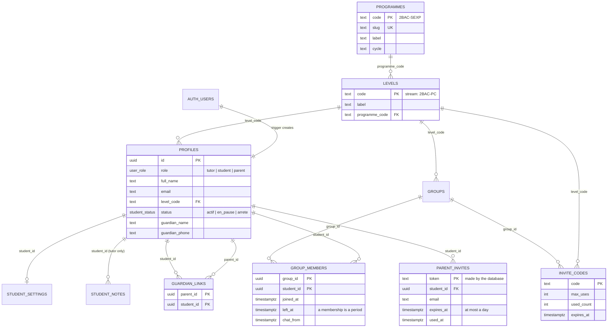
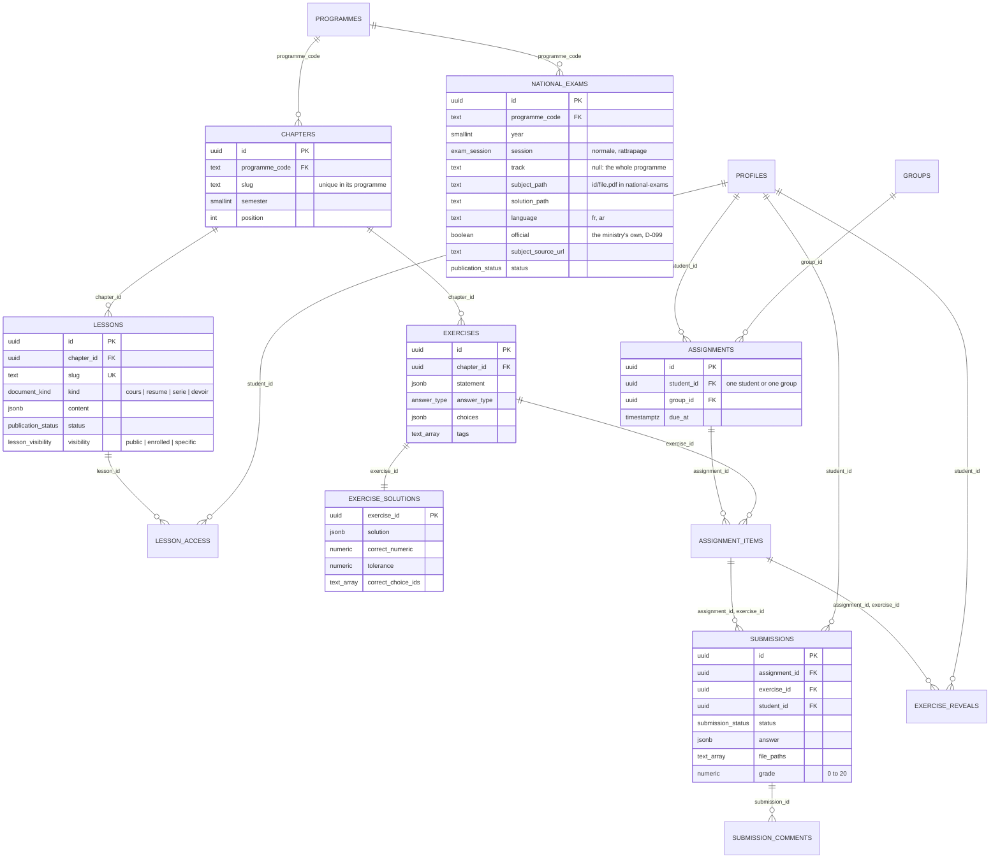
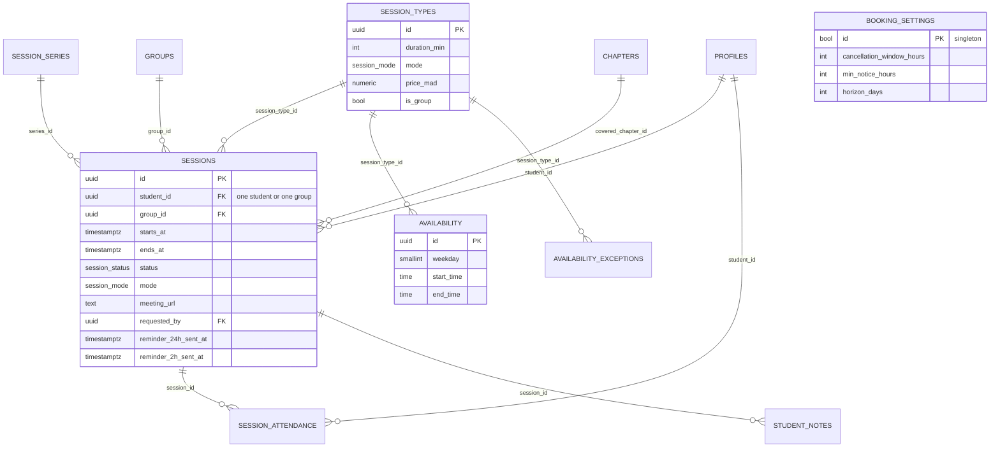
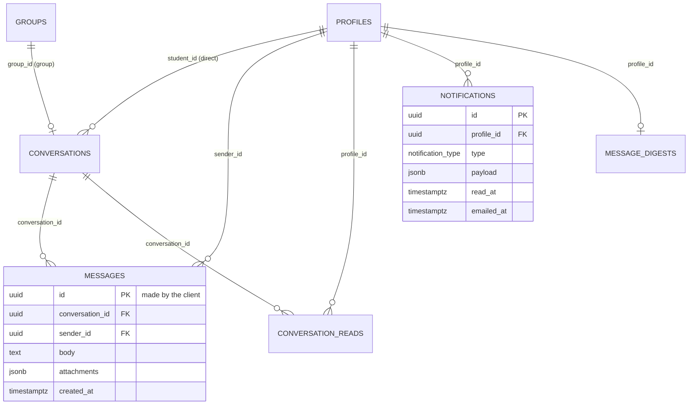
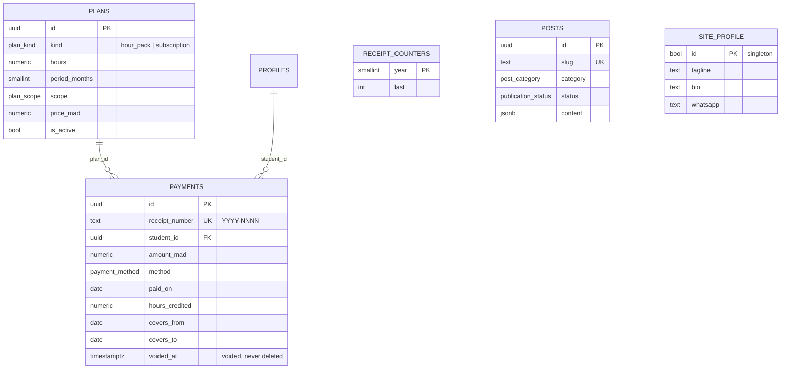

# Schema

The database after phase 4 and the programmes (D-094), read from the live project (38 tables in
`public`, one in `private`, four storage buckets). Every table has RLS enabled and a policy per operation; a table with no
policy for an operation refuses it. The reasons behind each rule are in `DECISIONS.md`.

One diagram per area, with the columns that carry the relations. The generated types in
`src/types/database.ts` list every column.

## Identity, levels and groups

## Lessons, exercises and homework

A past national exam (D-097) is one paper of one session of one year, for a programme or the
part of its streams that sat it. Its PDFs live in the paper's own folder of the public
`national-exams` bucket; one paper per programme, year, session and track.

## Sessions and bookings

## Chat and notifications

## Payments, public site and blog

## Who can read what

Parents read their linked children through checked functions (below) rather than through the
table policies, except for the three rows marked.

| Table                                                       | Signed out                        | Student                                                                  | Parent                   | Tutor                                              |
| ----------------------------------------------------------- | --------------------------------- | ------------------------------------------------------------------------ | ------------------------ | -------------------------------------------------- |
| `programmes`, `levels`, `chapters`                          | all                               | all                                                                      | all                      | all, writes                                        |
| `lessons`, `lesson_access`                                  | published + public                | published + public, own level (`enrolled`), or listed in `lesson_access` | published + public       | all, writes                                        |
| `national_exams`                                            | published ones                    | published ones                                                           | published ones           | all, writes                                        |
| `profiles`                                                  | —                                 | own row; edits contact fields only                                       | own row, linked children | all, writes                                        |
| `student_settings`                                          | —                                 | own row                                                                  | —                        | all, writes                                        |
| `student_notes`                                             | —                                 | —                                                                        | —                        | all, writes                                        |
| `groups`, `group_members`                                   | —                                 | groups they belong to, own memberships                                   | —                        | all, writes                                        |
| `invite_codes`                                              | via `invite_code_is_valid()` only | via `invite_code_is_valid()` only                                        | —                        | all, writes                                        |
| `exercises`                                                 | —                                 | those in homework that reaches them                                      | —                        | all, writes                                        |
| `exercise_solutions`                                        | —                                 | once corrected or revealed                                               | —                        | all, writes                                        |
| `assignments`, `assignment_items`                           | —                                 | homework that reaches them (by their standing, D-060)                    | —                        | all, writes                                        |
| `submissions`                                               | —                                 | own; written only through `submit_exercise_answer()`                     | —                        | all, corrects                                      |
| `submission_comments`                                       | —                                 | own, once corrected                                                      | —                        | all, writes                                        |
| `exercise_reveals`                                          | —                                 | own; adds one for assigned work                                          | —                        | all                                                |
| `session_types`                                             | active ones                       | active ones                                                              | active ones              | all, writes                                        |
| `sessions`                                                  | —                                 | own and own groups' (by their standing, D-060)                           | —                        | all, writes                                        |
| `session_attendance`                                        | —                                 | own rows                                                                 | —                        | all, writes                                        |
| `session_series`, `availability`, `availability_exceptions` | —                                 | — (free slots through `booking_calendar()`)                              | —                        | all, writes                                        |
| `booking_settings`                                          | —                                 | read                                                                     | read                     | read, writes                                       |
| `conversations`, `messages`, `conversation_reads`           | —                                 | conversations they take part in; sends through `send_message()`          | —                        | all hers                                           |
| `notifications`                                             | —                                 | own                                                                      | own                      | own                                                |
| `message_digests`, `receipt_counters`                       | —                                 | — (functions only)                                                       | —                        | — (functions only)                                 |
| `plans`                                                     | offered ones                      | offered ones                                                             | offered ones             | all, writes                                        |
| `payments`                                                  | —                                 | own                                                                      | linked children's        | all, through `record_payment()` / `void_payment()` |
| `posts`                                                     | published                         | published                                                                | published                | all, writes                                        |
| `site_profile`                                              | read                              | read                                                                     | read                     | read, writes                                       |
| `guardian_links`                                            | —                                 | —                                                                        | own links                | all, writes                                        |
| `parent_invites`                                            | —                                 | —                                                                        | —                        | all; writes who and for which student only         |
| `private.rate_limits`                                       | —                                 | —                                                                        | —                        | —                                                  |

## Functions the app calls

Each one is `security definer`, checks who is calling before anything else, and is refused to
signed-out visitors unless noted.

| Area          | Functions                                                                                                                                                            |
| ------------- | -------------------------------------------------------------------------------------------------------------------------------------------------------------------- |
| Sign-up       | `invite_code_is_valid()` (signed-out visitors too)                                                                                                                   |
| Exercises     | `save_exercise()`, `create_assignment()`, `delete_assignment()`, `submit_exercise_answer()`                                                                          |
| Sessions      | `booking_calendar()`, `request_session()`, `cancel_my_session()`, `plan_sessions()`, `cancel_sessions()`, `close_session()`, `add_session_reminder()`                |
| Chat          | `send_message()`, `my_inbox()`, `mark_conversation_read()`, `stale_message_files()`                                                                                  |
| Notifications | `mark_notifications_read()`, `notifications_to_email()`, `claim_notification_email()`, `message_digests_due()`, `claim_message_digest()`, `release_message_digest()` |
| Payments      | `record_payment()`, `void_payment()`, `student_accounts()`, `account_statement()`, `remove_test_payments()` (secret key only)                                        |
| Parents       | `my_children()`, `child_sessions()`, `child_homework()`                                                                                                              |
| Documents     | `take_print_quota()` before a PDF of a document that is not public, `take_public_print_quota()` (signed-out visitors too) before one of a public document (D-096)    |

## Storage

| Bucket           | Reads                                                    | Writes                                                |
| ---------------- | -------------------------------------------------------- | ----------------------------------------------------- |
| `lesson-assets`  | public (images inside lessons, unguessable paths)        | the tutor                                             |
| `lesson-files`   | whoever may read the lesson                              | the tutor                                             |
| `submissions`    | the student their own pages, the tutor all (signed URLs) | the student, inside their own folder, until handed in |
| `message-files`  | whoever may read the message that holds the file         | a participant, inside their own folder                |
| `national-exams` | public (past papers, unguessable paths for drafts)       | the tutor, PDFs only                                  |

## Invariants the database enforces

- Exactly one tutor (`profiles_single_tutor` partial unique index).
- Nobody chooses their own role. A new account is a student, and needs a valid invite code, or a parent, with an unused, unexpired invitation made for its very address (`private.handle_new_user`). Only the seed, which writes `auth.users` directly, bypasses both.
- Students can't change their role, status, level or email (`private.guard_profile_update`).
- A session, an assignment and a conversation belong to one student or one group, never both.
- Confirmed sessions never overlap (`sessions_no_overlap` exclusion constraint).
- A handed-in page is never replaced, and a corrected submission always has a grade between 0 and 20.
- Booking requests and messages are rate-limited in the database (`too_many_requests`, `private.rate_limits`).
- A payment is voided with a reason, never deleted; receipt numbers run per year and are never reused.
- Every timestamp is `timestamptz`; days are counted in Africa/Casablanca.
