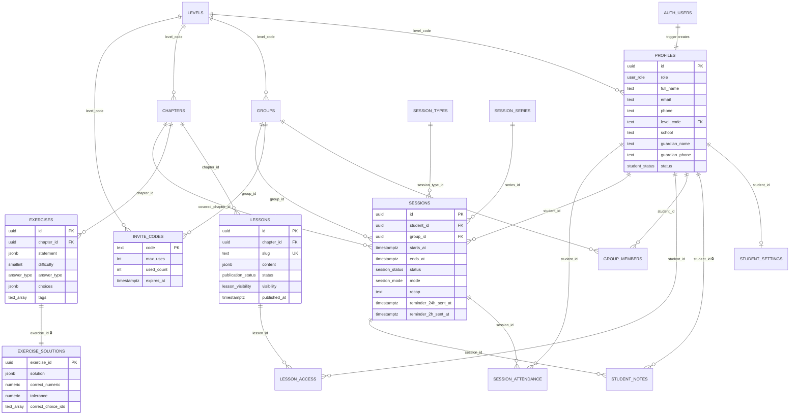

# Schema

Tables that exist after phase 0. Phase 1 adds assignments and submissions, phase 2 availability
and booking policies, phase 3 conversations, messages and notifications, phase 4 payments, posts
and guardian links (see the brief, §5).

Every table has RLS enabled. 🔒 marks tables only the tutor can read.

## Who can read what

| Table                                | Signed out                        | Student                                                                  | Tutor       |
| ------------------------------------ | --------------------------------- | ------------------------------------------------------------------------ | ----------- |
| `levels`, `chapters`                 | all                               | all                                                                      | all, writes |
| `lessons`                            | published + public                | published + public, own level (`enrolled`), or listed in `lesson_access` | all, writes |
| `profiles`                           | —                                 | own row; may edit contact fields only                                    | all, writes |
| `student_settings`                   | —                                 | own row                                                                  | all, writes |
| `student_notes` 🔒                   | —                                 | —                                                                        | all, writes |
| `groups`, `group_members`            | —                                 | groups they belong to, own memberships                                   | all, writes |
| `invite_codes`                       | via `invite_code_is_valid()` only | via `invite_code_is_valid()` only                                        | all, writes |
| `exercises`, `exercise_solutions` 🔒 | —                                 | — (phase 1 opens exercises through assignments)                          | all, writes |
| `session_types`                      | active ones                       | active ones                                                              | all, writes |
| `sessions`                           | —                                 | own and own groups'                                                      | all, writes |
| `session_attendance`                 | —                                 | own rows                                                                 | all, writes |
| `session_series`                     | —                                 | —                                                                        | all, writes |

## Invariants the database enforces

- Exactly one tutor (`profiles_single_tutor` partial unique index).
- A new account is always a student, and needs a valid invite code or tutor provisioning (`private.handle_new_user`).
- Students can't change their role, status, level or email (`private.guard_profile_update`).
- A session belongs to one student or one group, never both.
- Confirmed sessions never overlap (`sessions_no_overlap` exclusion constraint).
- Every timestamp is `timestamptz`.
